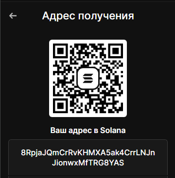

HTML

  

Solana Copy Trade Monitor
A simple and effective tool for tracking large-scale transactions across a specified list of wallets on the Solana network in real time.

🚀 Features
WebSocket Monitoring: Instantly receive data directly from the Solana network.

Telegram Notifications: Get alerts about trades sent directly to your messenger.

Flexible Configuration: Set a minimum transaction threshold (in SOL) to avoid distractions from "dust."

🛠 Installation
Clone the repository:

Bash
git clone https://github.com/rdin777/solana-copy-trade-bot-public.git
cd solana-copy-trade-bot-public
Create a virtual environment and install the dependencies:

Bash
python3 -m venv venv
source venv/bin/activate
pip install -r requirements.txt

Setup:

Copy the configuration file: cp config.py.example config.py
Enter your details into `config.py` (bot token and Chat ID).

Edit the list of wallets in `src/scanner.py`.

Launch:

Bash
python3 src/scanner.py

⚙️ Project Structure
src/scanner.py — Main monitoring file.

requirements.txt — List of libraries.

config.py — Configuration data.

⚠️ Security
Never publicly share files containing actual API keys or tokens. Use this bot strictly for educational purposes.

## ☕ Support the Project
If you found this tool useful, you can support the project's development:
- **Solana:**8RpjaJQmCrRvKHMXA5ak4CrrLNJnJionwxMfTRG8YAS
- 
